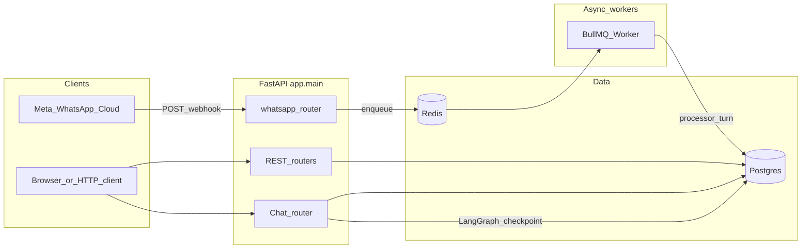

# Architecture

## Overview

salon-bot is a single FastAPI application that exposes:

1. **REST APIs** for salon operations (employees, services, employee-service links, appointments, availability).
2. **Chat APIs** under `/chat` (simulated client) plus **`/customers`** for fixture-friendly customer creation.
3. **WhatsApp** Meta Cloud API webhooks under `/webhooks/whatsapp`, processed asynchronously via **BullMQ** when Redis is configured.

Persistence is **PostgreSQL**. The LangGraph agent uses **AsyncPostgresSaver** for conversation checkpoints (same DB server as the app URL, libpq-compatible connection string).

## Component diagram

## Request lifecycles

### REST / simulated chat

1. Uvicorn serves `app.main:app`.
2. **`lifespan`** (`app/main.py`): configures logging, enters **`chat_lifespan`** (`app/chat/bootstrap.py`), which compiles the LangGraph agent + checkpointer, starts the WhatsApp BullMQ worker if `REDIS_URL` is set, then yields.
3. **`RequestContextMiddleware`** binds `request_id`, method, path into structlog context vars.
4. Routers use **`Depends(get_session)`** for per-request `AsyncSession` (rollback on exception; callers commit explicitly).

### WhatsApp inbound

1. Meta **POST**s to `/webhooks/whatsapp` with a JSON body.
2. **`receive_whatsapp_webhook`** (`app/chat/whatsapp_api.py`) reads the raw body (for optional HMAC verification), parses JSON, extracts text messages via **`extract_inbound_text_messages`**, enqueues one BullMQ job per message with **`jobId = wa-{message_id}`** for idempotency.
3. The handler generally returns **200** quickly so Meta does not retry floods; signature failures return **403** when `WHATSAPP_APP_SECRET` is configured (see [QUEUES.md](QUEUES.md)).
4. **Worker** (`app/chat/whatsapp_queue.py`) runs **`process_whatsapp_inbound_job`**: opens a session, **`process_inbound_chat_turn`** (same path as HTTP chat), optionally **`send_whatsapp_text_message`** via httpx to Graph API.

## Key modules

| Module | Role |
|--------|------|
| `app/db.py` | `create_async_engine`, `async_sessionmaker`, `get_session`, `Base` + naming convention |
| `app/config.py` | `Settings` singleton |
| `app/chat/orchestration.py` | Shared inbound turn: upsert customer/conversation, optional `run_turn` |
| `app/chat/agent/graph.py` | `build_chat_model`, middleware, `graph_with_checkpointer` |
| `app/chat/agent/runner.py` | `run_turn`, `inject_manual_ai_message`, ContextVar wiring |
| `app/chat/agent/tools.py` | LangChain tools hitting DB |

## Shutdown

`lifespan` teardown: WhatsApp worker/queue close, LangGraph checkpointer context exit, **`await engine.dispose()`**.
